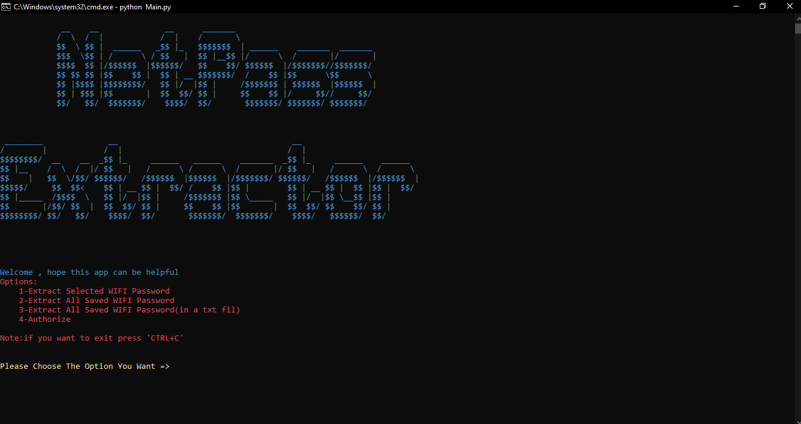

<!-- Heading -->
# NetPass Extractor

> __NetPass Extractor__ has been made by __MR-Black03__ to help you extract one or all saved WIFI password from a system easily.Hope you enjoy it.


___
<!-- Features -->
## Features:
    1.Extract all saved Wifi Password in a TXT file
    2.Show all saved wifi password in terminal
    3.Show your selected WIFI saved password
___
<!-- Dependencies -->
## Dependencies:
* Python3.9

* This app only works on Windows OS
___
<!-- Installation -->
## Installation:
```
 $git clone https://github.com/MR-Black03/NetPass_Extractor.git
 $cd NetPass_Extractor
 $Python -m pip install -r requirements.txt
 $python Main.py
```
___
#### Contact:
* [Email](amirhuseinnazemi@gmail.com "My Email Address")
* [Telegram](https://telegram.me/Amir_HosseinNazemi "My Telegram Account")
